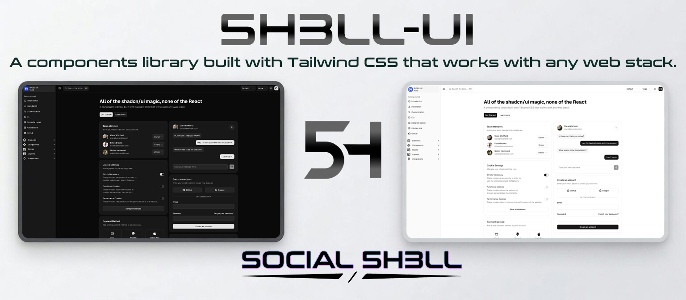
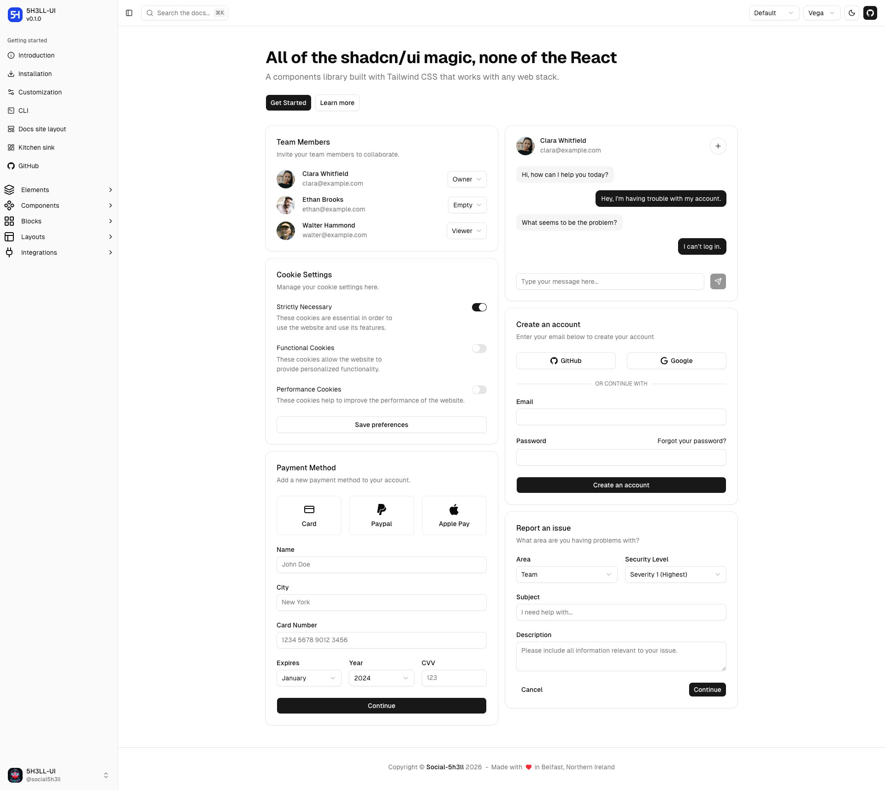
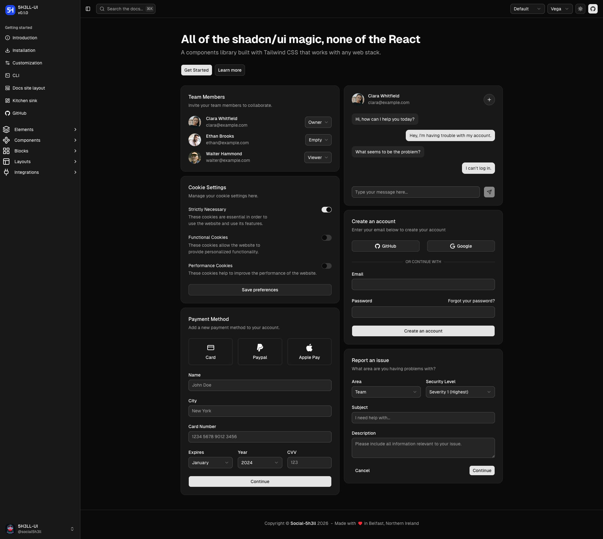

# 5H3LL-UI

[](https://www.npmjs.com/package/@social-5h3ll/5h3ll-ui)
[](LICENSE.md)

5H3LL-UI is a Tailwind CSS, vanilla HTML/CSS/JavaScript implementation of the shadcn/ui design system — components for any web stack without React, Radix, or framework runtime dependencies.



## Features

- **Semantic HTML-first** components built on accessible markup.
- **Tailwind CSS v4** source files and generated CSS bundles.
- **Vanilla JavaScript** for components that need behaviour — no framework required.
- **Nunjucks and Jinja** template macros for templating workflows.
- **Eight style packs** — Vega, Nova, Maia, Lyra, Mira, Luma, Sera, and Rhea.
- **Dark mode** and full CSS variable theming.
- **Three usage paths** — CDN, npm, and CLI.
- **DESIGN.md brand skins** — six ready-made skins for OpenClaw, Hermes, Cursor, Claude, Grok, and OpenAI. Ship on-brand UIs without starting from scratch.
- **AI agent-ready** — `/llms.txt` endpoint on the docs site. Give any AI coding agent the brand tokens and they generate on-brand UI.
- **Interactive design demos** — live, interactive demos for every brand skin. Copy the markup, see it render.

## Brand Skins

Six brand skins ship with on-brand tokens, ready to drop into any project:

| Skin | Description |
|------|-------------|
| **OpenClaw** | Coral-red primary, cyan secondary — full interactive replica at `/design-demos/openclaw/` |
| **Hermes** | Blueprint grid background, terminal UI — full interactive replica at `/design-demos/hermes/` |
| **Claude** | Anthropic-inspired minimal aesthetic |
| **Cursor** | Cursor IDE visual language |
| **Grok** | xAI/Grok visual style |
| **OpenAI** | ChatGPT/OpenAI brand tokens |

Install a skin via CLI:

```bash
npx @social-5h3ll/5h3ll-cli design openclaw   # generate openclaw skin
npx @social-5h3ll/5h3ll-cli design chatgpt   # alias → openai
npx @social-5h3ll/5h3ll-cli design xai        # alias → grok
npx @social-5h3ll/5h3ll-cli design nousresearch  # alias → hermes
```

Each skin includes a `tokens.css` with brand-specific CSS variable overrides and a `DESIGN.md` spec so AI agents understand the design intent.

## Themes

5H3LL-UI ships with semantic token-based theming. Switch between packs or use the base layer to build your own.

| Light | Dark |
|-------|------|
|  |  |

## Quick Start

### npm

```bash
npm install @social-5h3ll/5h3ll-ui
```

```css
@import "tailwindcss";
@import "@social-5h3ll/5h3ll-ui";
```

Or use a specific style pack:

```css
@import "tailwindcss";
@import "@social-5h3ll/5h3ll-ui/nova";
```

### CDN

```html
<!-- Vega (default) -->
<link rel="stylesheet" href="https://cdn.jsdelivr.net/npm/@social-5h3ll/5h3ll-ui@0.1.2/5h3ll_ui.cdn.css">

<!-- Specific style pack -->
<link rel="stylesheet" href="https://cdn.jsdelivr.net/npm/@social-5h3ll/5h3ll-ui@0.1.2/5h3ll_ui-nova.cdn.css">
```

### CLI

```bash
npx @social-5h3ll/5h3ll-cli init             # scaffold 5H3LL-UI into a project
npx @social-5h3ll/5h3ll-cli add button        # add a component
npx @social-5h3ll/5h3ll-cli design openclaw   # install a brand skin
```

## Documentation

- **Website** — [ui.5h3ll.site](https://ui.5h3ll.site)
- **Installation** — [ui.5h3ll.site/installation](https://ui.5h3ll.site/installation)
- **Customization** — [ui.5h3ll.site/customization](https://ui.5h3ll.site/customization)
- **Design skins** — [ui.5h3ll.site/integrations/design-md](https://ui.5h3ll.site/integrations/design-md)
- **AI agents** — [ui.5h3ll.site/integrations/llms](https://ui.5h3ll.site/integrations/llms)

## Packages

This repository publishes two workspace packages:

- [`@social-5h3ll/5h3ll-ui`](packages/css/README.md) — CSS, JavaScript, Nunjucks macros, and Jinja macros.
- [`@social-5h3ll/5h3ll-cli`](packages/cli/README.md) — CLI for adding 5H3LL-UI assets and brand skins to a project.

## CSS Architecture

5H3LL-UI separates structure from style:

| Layer | Path | Purpose |
|-------|------|---------|
| Base | `src/css/base/base.css` | Shared tokens and semantic utilities |
| Components | `src/css/components/*.css` | Layout, accessibility selectors, behaviour hooks |
| Styles | `src/css/styles/*.css` | Visual rules — colour, radius, shadow, typography, spacing |

Generated source entrypoints are committed for transparency and package imports:

- `src/css/5h3ll_ui.css` — default Vega bundle
- `src/css/5h3ll_ui-base.css` — base + components, no style pack
- `src/css/5h3ll_ui-components.css` — component imports only
- `src/css/5h3ll_ui-{style}.css` — base + one style pack
- `src/css/5h3ll_ui-{style}.cdn.css` — CDN-compatible wrapper

## Repository Layout

```
.
├── agents/
│   ├── SKILL.md           AI agent skill definition
│   └── design-md/         Brand skin tokens and DESIGN.md specs
├── docs/                  Eleventy documentation site
├── packages/
│   ├── cli/               @social-5h3ll/5h3ll-cli
│   └── css/               @social-5h3ll/5h3ll-ui
├── scripts/               Build and generation scripts
└── src/
    ├── css/
    │   ├── base/          Shared tokens, base layer, semantic utilities
    │   ├── components/    Component structure and behaviour hooks
    │   └── styles/        Style-pack visual rules
    ├── jinja/             Jinja component macros
    ├── js/                Vanilla JS components and registry
    └── nunjucks/          Nunjucks component macros
```

## Development

```bash
# Install dependencies
npm ci

# Run the docs site
npm run docs:dev

# Build package assets
npm run build

# Build the static docs site
npm run docs:build

# Run the Workers docs site locally
npm run workers:dev

# Deploy the Workers docs site
npm run workers:deploy
```

## Links

- **GitHub** — [Social-5H3LL/5h3ll-ui](https://github.com/Social-5H3LL/5h3ll-ui)
- **X** — [@social5h3ll](https://x.com/social5h3ll)
- **Docs** — [ui.5h3ll.site](https://ui.5h3ll.site)

## Security

In v0.1.1, four DOM XSS vectors in the Toast component were identified and eliminated. All user-provided text is set via `textContent`, URL schemes are validated to `http:` and `https:` only, inline `onclick` attributes were replaced with event delegation, and `new Function` was replaced with a `CustomEvent` interface.

## License

[MIT](LICENSE.md)